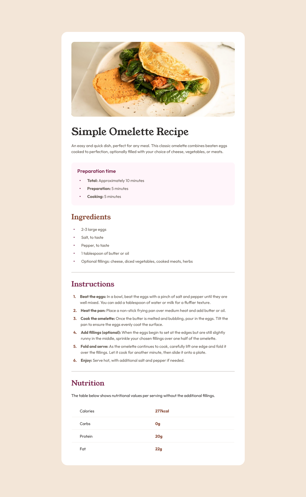

# Frontend Mentor - Recipe page solution

This is a solution to the [Recipe page challenge on Frontend Mentor](https://www.frontendmentor.io/challenges/recipe-page-KiTsR8QQKm). Frontend Mentor challenges help you improve your coding skills by building realistic projects.

## Table of contents

- [Overview](#overview)
  - [The challenge](#the-challenge)
  - [Screenshot](#screenshot)
  - [Links](#links)
- [My process](#my-process)
  - [Built with](#built-with)
  - [What I learned](#what-i-learned)
  - [Continued development](#continued-development)
- [Author](#author)

**Note: Delete this note and update the table of contents based on what sections you keep.**

## Overview

### Screenshot

### Links

- Solution URL: (https://www.frontendmentor.io/solutions/responsive-recipe-page-html-and-css-dPdoF67-ft)
- Live Site URL: (https://davidgasanov.github.io/recipe-page/)

## My process

### Built with

- Semantic HTML5 markup
- CSS custom properties
- CSS variables
- Flexbox
- Mobile-first workflow

### What I learned

Refreshed my knowledge of the css basics which I haven't touched in a long time, such as media queries, chaining selectors and pseudo-selectors. Learned a couple of things about building semantic HTML structure, and which sections correspond to which tags.

### Continued development

I want to become more comfortable with vanilla CSS & HTML, especially things such as tables, since they are tricky to style. I would also like to improve in reusing CSS styles.

## Author

- Frontend Mentor - [@yourusername](https://www.frontendmentor.io/profile/davidGasanov)
